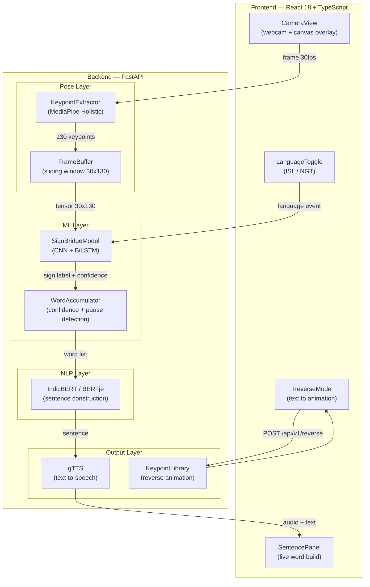
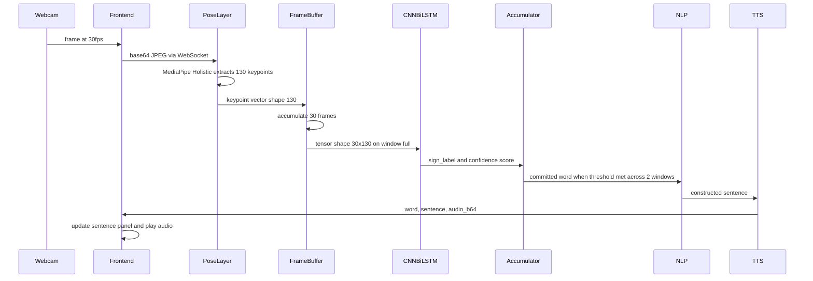
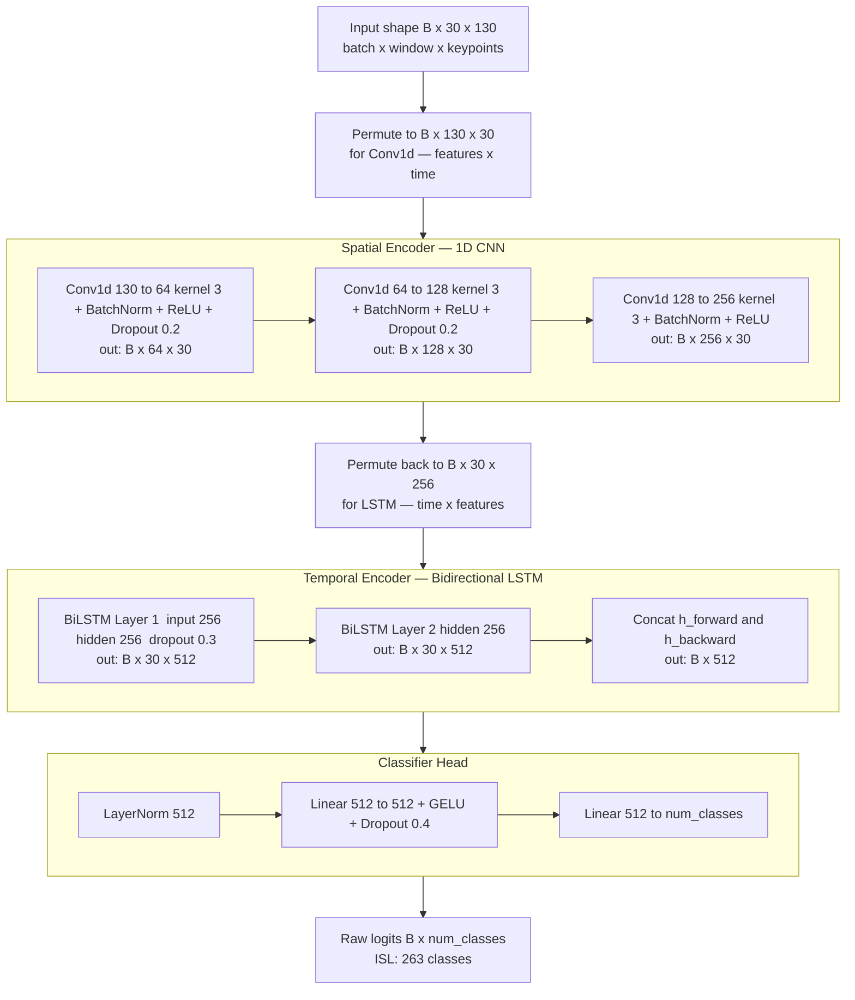
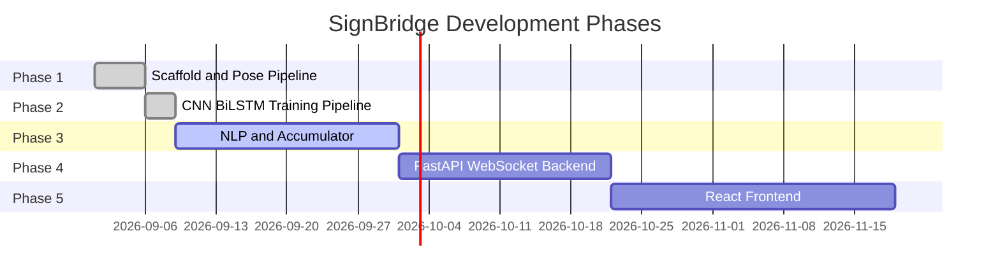
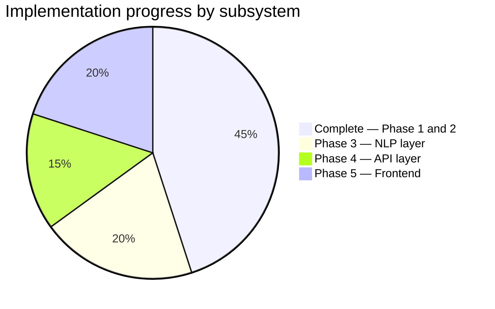

# SignBridge

**Real-time, bidirectional sign language interpreter supporting ISL (Indian Sign Language) and NGT (Nederlandse Gebarentaal / Dutch Sign Language).**

SignBridge takes live webcam input, extracts hand and pose keypoints, classifies the sign being performed, assembles the recognised words into a grammatically correct sentence using language-specific transformers, and speaks it aloud — all in real time. A reverse mode converts typed text back into an animated signing sequence on screen.

The project is built incrementally across five development phases. Phases 1 and 2 are complete. Phases 3–5 are planned.

---

## Table of Contents

1. [Problem Statement](#1-problem-statement)
2. [Motivation](#2-motivation)
3. [Objectives](#3-objectives)
4. [Complete System Overview](#4-complete-system-overview)
5. [System Architecture](#5-system-architecture)
6. [Data Flow](#6-data-flow)
7. [Core Concepts and Algorithms](#7-core-concepts-and-algorithms)
8. [Technologies and Stack](#8-technologies-and-stack)
9. [Datasets](#9-datasets)
10. [Project Structure](#10-project-structure)
11. [Module Reference](#11-module-reference)
12. [Installation and Setup](#12-installation-and-setup)
13. [Usage](#13-usage)
14. [Testing](#14-testing)
15. [Development Phases](#15-development-phases)
16. [Current Implementation Status](#16-current-implementation-status)
17. [Known Limitations](#17-known-limitations)
18. [Future Work](#18-future-work)
19. [Documentation Map](#19-documentation-map)
20. [Author](#20-author)

---

## 1. Problem Statement

Deaf and hard-of-hearing individuals who use sign language as their primary language face a persistent communication barrier: the majority of spoken-language users cannot understand sign language, and very few interpreters are available in everyday contexts — schools, hospitals, workplaces, public services.

Existing software solutions for sign language recognition are mostly research prototypes:

- They target ASL almost exclusively, ignoring ISL (80+ million signers in India) and NGT (18,000–20,000 signers in the Netherlands).
- They require expensive depth cameras or purpose-built sensor gloves.
- They are not bidirectional — they can only translate signing to text, not text back to signing.
- They do not produce natural spoken-language output from recognised signs.

SignBridge addresses all four gaps.

---

## 2. Motivation

Two languages were chosen deliberately to maximise research value and practical impact:

**ISL — Indian Sign Language** is one of the most underserved sign languages in the world relative to the size of its user community. The INCLUDE dataset (ACM Multimedia 2020) is the first large-scale isolated-sign benchmark for ISL, making Phase 2 training tractable for the first time.

**NGT — Nederlandse Gebarentaal** represents a structurally different language family from ISL. NGT has non-manual markers (facial expressions that carry grammatical meaning) and a topic-comment sentence structure. Building a system that works for both languages forces the architecture to be genuinely language-agnostic rather than language-specific.

Supporting two structurally different sign languages in one system also means the architecture generalises more easily to future additions (BSL, ASL, Auslan, etc.).

---

## 3. Objectives

- Classify isolated ISL signs in real time from webcam input using a CNN + BiLSTM model trained on the INCLUDE dataset (265 classes, 71.35% top-1 accuracy on test set).
- Classify NGT signs after Phase 3 annotation parsing of the HoReCo corpus.
- Assemble recognised signs into grammatically correct sentences using IndicBERT (ISL) and BERTje (NGT).
- Speak the constructed sentence aloud using text-to-speech.
- Animate the reverse direction: typed text → signed animation played back on screen.
- Run entirely on commodity hardware (no depth sensor, no GPU required for inference).
- Achieve real-time performance at ≥ 30 fps pose extraction on a modern laptop CPU.

---

## 4. Complete System Overview

The finished SignBridge system has two operating modes.

**Forward mode (signing → spoken language):**
The user signs in front of their webcam. The system extracts hand and pose keypoints from each frame, accumulates 30-frame windows, classifies each window as a sign, commits recognised words above a confidence threshold, constructs a grammatical sentence from the word list, and plays the sentence as audio.

**Reverse mode (text → signed animation):**
A hearing user types a message. The system tokenises the sentence into sign vocabulary words, looks up reference keypoint sequences for each word, and plays back a skeleton animation on screen that the deaf user can read.

```
┌──────────────────────────────────────────────────────────────┐
│                   FORWARD MODE — Signing → Speech            │
│                                                              │
│  Webcam  →  Pose Layer  →  ML Layer  →  NLP Layer  →  TTS   │
│  (30fps)    (MediaPipe)    (CNN+BiLSTM)  (IndicBERT)  (gTTS) │
└──────────────────────────────────────────────────────────────┘

┌──────────────────────────────────────────────────────────────┐
│                   REVERSE MODE — Text → Animation            │
│                                                              │
│  Text Input  →  NLP Tokeniser  →  Keypoint Library  →  Canvas│
└──────────────────────────────────────────────────────────────┘
```

---

## 5. System Architecture

### Layer diagram



### Component summary

| Component                   | Location                                | Status      |
| --------------------------- | --------------------------------------- | ----------- |
| KeypointExtractor           | `backend/pose/extractor.py`           | ✅ Complete |
| FrameBuffer                 | `backend/pose/buffer.py`              | ✅ Complete |
| SkeletonVisualiser          | `backend/pose/visualizer.py`          | ✅ Complete |
| DatasetLoader               | `backend/ml/data/loader.py`           | ✅ Complete |
| SignBridgeModel             | `backend/ml/models/sign_model.py`     | ✅ Complete |
| KeypointAugmentation        | `backend/ml/data/augmentation.py`     | ✅ Complete |
| Trainer                     | `backend/ml/training/trainer.py`      | ✅ Complete |
| LabelSmoothingCrossEntropy  | `backend/ml/training/losses.py`       | ✅ Complete |
| Evaluator + ReportGenerator | `backend/ml/evaluation/`              | ✅ Complete |
| WordAccumulator             | `backend/ml/inference/accumulator.py` | ⏳ Phase 3  |
| NLP sentence construction   | `backend/nlp/`                        | ⏳ Phase 3  |
| TTS                         | `backend/tts/`                        | ⏳ Phase 3  |
| FastAPI + WebSocket         | `backend/api/` + `backend/main.py`  | ⏳ Phase 4  |
| React frontend              | `frontend/`                           | ⏳ Phase 5  |

---

## 6. Data Flow

### Forward mode — frame by frame



### Keypoint vector layout

Every frame produces exactly **130 float32 values**:

| Index range | Source                                                                        | Count |
| ----------- | ----------------------------------------------------------------------------- | ----- |
| 0–62       | Left hand (21 landmarks × x, y, z)                                           | 63    |
| 63–125     | Right hand (21 landmarks × x, y, z)                                          | 63    |
| 126–129    | Pose context (left shoulder x, right shoulder x, left wrist x, right wrist x) | 4     |

Zero-filled when a hand is not detected in frame. This preserves the fixed vector shape required by the CNN. The model learns to ignore zero regions rather than receiving misleading data.

### Sliding window — 50% overlap

```mermaid
gantt
    title Sliding window — 30-frame windows with 15-frame stride
    dateFormat X
    axisFormat %s

    section Window 1
    Frames 0 to 29   :0, 30
    section Window 2
    Frames 15 to 44  :15, 45
    section Window 3
    Frames 30 to 59  :30, 60
```



The 50% overlap ensures that signs which begin mid-window are still captured in the next window. Without overlap, a sign that starts at frame 28 would be split across two windows and likely misclassified by both.

---

## 7. Core Concepts and Algorithms

### 7.1 Model architecture — CNN + Bidirectional LSTM

Sign language recognition requires two distinct capabilities: understanding the spatial structure of a hand configuration within a single frame (which finger is raised, the orientation of the palm), and understanding how that configuration changes over time across 30 frames (the motion trajectory of the sign).

The architecture separates these concerns explicitly.



**Why 1D CNN before LSTM?**
The Conv1d operates across the feature dimension (130 keypoints) at each time step independently. Each filter learns to detect a particular combination of keypoint positions — a specific finger extension, a particular wrist angle. These spatial features become the LSTM input, which then models how they evolve over time. If the LSTM received raw keypoints directly, it would need to simultaneously learn both spatial and temporal structure, which makes training slower and harder to converge.

**Why bidirectional?**
Sign language has temporal structure in both directions. The release phase of a sign (what comes after the peak configuration) is as diagnostically useful as the approach phase. A bidirectional LSTM reads the sequence both ways and concatenates the final hidden states, giving the classifier access to the complete temporal context of the 30-frame window.

**Estimated parameter count (ISL, 263 classes):**

| Component                 | Parameters      |
| ------------------------- | --------------- |
| Spatial encoder (CNN)     | ~250K           |
| Temporal encoder (BiLSTM) | ~2.6M           |
| Classifier head           | ~650K           |
| **Total**           | **~3.18M** |

### 7.2 Data augmentation

Three shape-preserving transforms are applied to training sequences only. Validation and test sets are never augmented.

| Transform                        | Description                                                                                                          | Probability |
| -------------------------------- | -------------------------------------------------------------------------------------------------------------------- | ----------- |
| `time_warp(sigma=0.2)`         | Cubic spline random time-axis distortion. Simulates signers who perform the same sign at slightly different speeds.  | 0.5         |
| `mirror_horizontal`            | Flips x-coordinates and swaps left/right hand blocks. Simulates left-handed signers from right-handed training data. | 0.5         |
| `add_gaussian_noise(std=0.01)` | Gaussian noise clipped to [0, 1]. Simulates minor tracking jitter from MediaPipe.                                    | 0.7         |

All outputs are guaranteed to be shape (30, 130) float32 — identical to the input.

### 7.3 Normalisation

Zero-mean, unit-variance normalisation is computed on the **training split only** and applied identically to validation and test splits. The normalisation statistics (mean and std per feature) are saved to `data/processed/norm_stats_isl.npy` so they can be loaded at inference time without recomputation.

This prevents data leakage: fitting normalisation on the full dataset before splitting would allow test-set distribution information to influence training, a subtle form of look-ahead bias.

### 7.4 Label smoothing

The loss function uses label smoothing (ε = 0.1), which replaces one-hot targets with:

```
y_smooth = (1 - ε) × y_one_hot + ε / num_classes
```

Many ISL signs in INCLUDE are visually similar (number signs, directional verbs, handshape families). Hard cross-entropy targets encourage the model to output probability 1.0 for the correct class, producing overconfident predictions that generalise poorly. Label smoothing distributes a small probability mass across all other classes, improving calibration.

Reference: Müller, Kornblith & Hinton (NeurIPS 2019). *When Does Label Smoothing Help?*

### 7.5 Training configuration

| Hyperparameter          | Value             | Rationale                                               |
| ----------------------- | ----------------- | ------------------------------------------------------- |
| Optimiser               | AdamW             | Decoupled weight decay; better regularisation than Adam |
| Learning rate           | 0.001             | Standard starting point for AdamW on sign datasets      |
| Weight decay            | 0.0001            | Mild L2 regularisation                                  |
| LR schedule             | CosineAnnealingLR | Smooth decay without abrupt step-drops                  |
| Batch size              | 32                | GPU-friendly; larger batches increase stability         |
| Label smoothing         | 0.1               | Reduces overconfidence on visually similar signs        |
| Gradient clipping       | 1.0               | Prevents exploding gradients in deep BiLSTM             |
| Early stopping patience | 15 epochs         | Allows recovery from plateaus                           |
| Dropout CNN             | 0.2               | Light regularisation in spatial encoder                 |
| Dropout LSTM            | 0.3               | Between LSTM layers                                     |
| Dropout classifier      | 0.4               | Heaviest at the prediction head                         |

### 7.6 Word accumulator (planned — Phase 3)

The accumulator sits between the model output and the NLP layer. It prevents noisy single-window predictions from being committed as recognised words.

- Confidence threshold: 0.85 (configurable via `.env`)
- A sign is committed when it appears in **2 consecutive windows** above threshold
- Pause detection: if no sign is detected for **1.5 seconds**, the sentence is finalised
- Duplicate suppression: the same sign cannot be committed twice consecutively

### 7.7 NLP sentence construction (planned — Phase 3)

ISL and NGT have fundamentally different grammar from their spoken-language counterparts. ISL generally follows topic-comment structure with reduced function words. NGT has its own spatial grammar with non-manual markers.

The NLP layer receives a raw list of committed sign glosses in sign-language grammar order and produces a grammatically correct spoken-language sentence:

- ISL gloss list → IndicBERT (ai4bharat/indic-bert) fine-tuned on ISL grammar corpus → Hindi/English sentence
- NGT gloss list → BERTje (GroNLP/bert-base-dutch-cased) fine-tuned on NGT corpus → Dutch sentence

---

## 8. Technologies and Stack

| Layer                      | Technology                  | Version         | Reason for choice                                                      |
| -------------------------- | --------------------------- | --------------- | ---------------------------------------------------------------------- |
| Pose extraction            | MediaPipe Holistic          | ≥ 0.10.30      | CPU-only, 30fps, no hardware requirements                              |
| ML framework               | PyTorch                     | 2.3.1           | Dynamic graphs simplify custom architectures; wider research ecosystem |
| Backend                    | FastAPI                     | 0.111.0         | Native async, WebSocket support, automatic OpenAPI docs                |
| Backend server             | Uvicorn                     | 0.30.1          | ASGI server compatible with FastAPI's async design                     |
| NLP                        | HuggingFace Transformers    | 4.41.2          | Best model hub for IndicBERT and BERTje                                |
| Data processing            | NumPy 1.26.4, SciPy ≥ 1.13 | —              | Time-warp augmentation uses scipy.interpolate                          |
| Configuration              | Pydantic-settings           | 2.3.4           | Type-safe config with .env loading, single source of truth             |
| Logging                    | Loguru                      | 0.7.2           | Structured, colourised, rotating file logs                             |
| Testing                    | pytest + pytest-cov         | 8.2.2 / 5.0.0   | Standard Python test stack                                             |
| Formatting                 | black + isort               | 24.4.2 / 5.13.2 | Enforced code style                                                    |
| Frontend (planned)         | React 18 + TypeScript       | —              | Component model maps cleanly to camera/sentence/animation panels       |
| Frontend state (planned)   | Zustand                     | —              | Simpler than Redux for this scale                                      |
| Frontend styling (planned) | Tailwind CSS                | —              | Utility-first, consistent with DESIGN.md token system                  |
| TTS (planned)              | gTTS                        | —              | Simple MP3 synthesis, no API key required                              |
| Deployment (planned)       | Docker + Vercel/Railway     | —              | Frontend static on Vercel, backend containerised                       |

**Hardware for inference:** Any modern CPU laptop. MediaPipe runs entirely on CPU. The ~3.5M parameter model fits in RAM and runs a forward pass in under 10ms on CPU.

**Hardware for training:** A CUDA GPU is recommended for full INCLUDE training (~4,292 videos). The trainer auto-detects GPU via `torch.cuda.is_available()`. CPU training is possible but slow for the full dataset. Set `DEVICE=cuda` in `.env` when a GPU is available.

---

## 9. Datasets

| Dataset                      | Language | Type                    | Size                      | Notes                                                                                                           |
| ---------------------------- | -------- | ----------------------- | ------------------------- | --------------------------------------------------------------------------------------------------------------- |
| INCLUDE                      | ISL      | Isolated signs          | 263 classes, ~4292 videos | 46 zip files. Primary training dataset for Phase 2. Reference: Sridhar et al., ACM MM 2020.                     |
| ISLVT                        | ISL      | Sentence videos + gloss | 153 videos + Excel        | ISL sentence-level. Excel contains Marathi/English gloss annotations. Used in Phase 3 for NLP fine-tuning.      |
| Indian Sign Language_Dataset | ISL      | Isolated sign videos    | Unknown until extracted   | Compressed as ISL.zip. Labels inferred from folder structure.                                                   |
| NGT HoReCo 1.2               | NGT      | Continuous conversation | 297 videos + Excel        | Timestamped gloss annotations in Multilingual-HoReCo.xlsx. Requires Phase 3 annotation parsing before training. |

All datasets live in `Datasets/` at the repository root and are gitignored. They must be obtained independently and placed in the correct directories as shown in `.env.example`.

> **Why is NGT not trained in Phase 2?**
> HoReCo 1.2 is a continuous signing corpus, not an isolated-sign dataset. Signs exist only as timestamped annotations in an Excel file against full-length conversation videos — there are no per-class video folders. Before training a classifier, the annotation must be parsed, each gloss segment cut from its video, and pose extraction run on each segment. This temporal segmentation work is Phase 3 scope. The `ngt_config.yaml` stub explicitly sets `num_classes: 0` to make this constraint visible at the code level.

---

## 10. Project Structure

```
ISL_NGT-Sign-Language-Interpreter/
│
├── Datasets/                              # Raw datasets — gitignored
│   ├── INCLUDE/                           # 263-class ISL isolated signs
│   ├── Indian Sign Language Video.../     # ISLVT sentence videos
│   ├── Indian Sign Language_Dataset/      # ISL isolated signs (ISL.zip)
│   └── NGT_HoReCo_1.2/                   # NGT continuous signing
│
├── MDs/                                   # Project-level design documents
│   ├── ARCHITECTURE.md                    # Full system architecture reference
│   ├── DESIGN.md                          # Frontend visual design system
│   └── RULES.md                           # Project conventions and agent rules
│
├── signbridge/                            # All source code
│   │
│   ├── backend/
│   │   ├── core/
│   │   │   ├── config.py                  # Pydantic Settings — all constants
│   │   │   └── logger.py                  # Loguru logger factory
│   │   │
│   │   ├── pose/
│   │   │   ├── extractor.py               # KeypointExtractor (MediaPipe Holistic)
│   │   │   ├── buffer.py                  # FrameBuffer (sliding window 30x130)
│   │   │   └── visualizer.py              # SkeletonVisualiser (debug rendering)
│   │   │
│   │   ├── ml/
│   │   │   ├── data/
│   │   │   │   ├── loader.py              # DatasetLoader (all 4 datasets)
│   │   │   │   ├── dataset.py             # SignSequenceDataset, build_dataloaders
│   │   │   │   └── augmentation.py        # KeypointAugmentation (3 transforms)
│   │   │   ├── models/
│   │   │   │   ├── sign_model.py          # SignBridgeModel (CNN + BiLSTM)
│   │   │   │   └── model_factory.py       # build_model(config, language)
│   │   │   ├── training/
│   │   │   │   ├── trainer.py             # Trainer (full training loop)
│   │   │   │   ├── losses.py              # LabelSmoothingCrossEntropy
│   │   │   │   └── configs/
│   │   │   │       ├── isl_config.yaml    # ISL training hyperparameters
│   │   │   │       └── ngt_config.yaml    # NGT stub (num_classes: 0)
│   │   │   ├── inference/                 # WordAccumulator — Phase 3
│   │   │   └── evaluation/
│   │   │       ├── evaluator.py           # Evaluator (all metrics)
│   │   │       └── report.py              # ReportGenerator (PNG + JSON)
│   │   │
│   │   ├── nlp/                           # Sentence construction — Phase 3
│   │   ├── tts/                           # Text-to-speech — Phase 3
│   │   ├── api/                           # FastAPI route handlers — Phase 4
│   │   ├── tests/
│   │   │   ├── test_pose.py               # 12 pose tests (Phase 1)
│   │   │   ├── test_buffer.py             # 14 buffer tests (Phase 1)
│   │   │   └── test_model.py              # 28 model tests (Phase 2)
│   │   └── main.py                        # FastAPI entry point — Phase 4
│   │
│   ├── data/
│   │   ├── processed/                     # .npy arrays from pose extraction
│   │   └── self_recorded/                 # Webcam recordings
│   │
│   ├── docs/phases/
│   │   ├── PHASE_1.md                     # Phase 1 implementation record
│   │   └── PHASE_2.md                     # Phase 2 implementation record
│   │
│   ├── scripts/
│   │   ├── collect_data.py                # Webcam data collection CLI
│   │   ├── prepare_data.py                # Dataset extraction + pose extraction
│   │   ├── train.py                       # Training CLI
│   │   ├── evaluate.py                    # Evaluation CLI
│   │   ├── run_phase_1.py                 # Phase 1 runner
│   │   ├── run_phase_2.py                 # Phase 2 runner (with step resumption)
│   │   └── run_all_phases.py              # Master runner
│   │
│   ├── runs/                              # Training logs + phase status files
│   ├── .env.example                       # Environment variable template
│   ├── requirements.txt                   # Python dependencies (pinned)
│   └── pyproject.toml                     # Project metadata
│
├── .gitignore
└── README.md
```

---

## 11. Module Reference

### `backend/core/config.py` — Settings

Single source of truth for all constants. All other modules import `settings` from here. No magic numbers anywhere else in the codebase.

| Setting                   | Default       | Description                                     |
| ------------------------- | ------------- | ----------------------------------------------- |
| `num_keypoints`         | 130           | Keypoint vector length per frame                |
| `window_size`           | 30            | Frames per sliding window                       |
| `stride`                | 15            | Window advance step (50% overlap)               |
| `confidence_threshold`  | 0.85          | Minimum confidence to consider a classification |
| `commit_streak`         | 2             | Consecutive windows required to commit a sign   |
| `pause_timeout_seconds` | 1.5           | Silence duration that finalises a sentence      |
| `device`                | auto-detected | CPU or CUDA                                     |

### `backend/pose/extractor.py` — KeypointExtractor

Wraps the MediaPipe Holistic Tasks API. Processes one BGR frame at a time.

- **Input:** `np.ndarray` shape `(H, W, 3)` BGR
- **Output:** `np.ndarray` shape `(130,)` float32
- Supports context manager protocol (`with KeypointExtractor() as ext:`)
- Zero-fills missing hands without raising exceptions

### `backend/pose/buffer.py` — FrameBuffer

Sliding window accumulator that fires when full.

- **Input stream:** `(130,)` keypoint vectors via `buffer.add(keypoints)`
- **Output:** `(30, 130)` numpy array emitted when window is full
- Configurable window size and stride via `settings`

### `backend/ml/models/sign_model.py` — SignBridgeModel

PyTorch `nn.Module` implementing the CNN + BiLSTM architecture.

```python
from backend.ml.models.sign_model import SignBridgeModel

model = SignBridgeModel(num_classes=263)
# Input: torch.Tensor [batch, 30, 130]
# Output: raw logits [batch, 263]
logits = model(x)
```

`model.get_num_parameters()` returns the total trainable parameter count.

### `backend/ml/data/loader.py` — DatasetLoader

Processes all four raw datasets into `.npy` arrays. Handles zip extraction, video frame reading (OpenCV), pose extraction (MediaPipe), and sliding window segmentation internally.

```python
with DatasetLoader() as loader:
    seqs, labels = loader.process_include_from_extracted(include_dir)
    # seqs: (N, 30, 130) float32
    # labels: (N,) int64
```

### `backend/ml/data/dataset.py` — SignSequenceDataset

PyTorch Dataset wrapping the `.npy` arrays with optional augmentation.

```python
from backend.ml.data.dataset import build_dataloaders

train_dl, val_dl, test_dl = build_dataloaders(language="ISL", augment=True)
```

The 70/15/15 train/val/test split is stratified to preserve class distributions.

### `backend/ml/training/trainer.py` — Trainer

Full training loop with AdamW optimiser, cosine annealing LR schedule, LabelSmoothingCrossEntropy loss, gradient clipping (max norm 1.0), early stopping (patience 15 epochs), best checkpoint saving to `backend/models/best_{language}.pt`, and run logging to `runs/` with timestamp.

### `backend/ml/evaluation/` — Evaluator + ReportGenerator

Computes top-1 accuracy, top-5 accuracy, macro F1, weighted F1, per-class accuracy, and confusion matrix. Saves PNG plots and a JSON report to `backend/ml/evaluation/reports/{language}_{timestamp}/`.

---

## 12. Installation and Setup

### Prerequisites

- Anaconda or Miniconda (Python 3.10)
- ~50 GB disk space for datasets and processed files
- CUDA-capable GPU recommended for training (not required for inference)

### Step 1 — Activate environment

This must be done before every Python command in this project.

```powershell
(C:\Users\Deep\anaconda3\shell\condabin\conda-hook.ps1) ; (conda activate base)
```

### Step 2 — Install dependencies

```powershell
cd signbridge
pip install -r requirements.txt
```

### Step 3 — Download the MediaPipe model

```powershell
Invoke-WebRequest -Uri https://storage.googleapis.com/mediapipe-models/holistic_landmarker/holistic_landmarker/float16/latest/holistic_landmarker.task -OutFile signbridge/backend/models/holistic_landmarker.task -UseBasicParsing
```

### Step 4 — Configure environment

```powershell
copy signbridge\.env.example signbridge\.env
```

Edit `.env` to set correct dataset paths and optionally `DEVICE=cuda` if a GPU is available.

### Step 5 — Verify setup

```powershell
cd signbridge
pytest backend/tests/ -v
```

All 54 tests (12 pose + 14 buffer + 28 model) should pass.

---

## 13. Usage

### Collect self-recorded signs

```powershell
cd signbridge
python scripts/collect_data.py --sign "hello" --samples 50 --language ISL
```

Shows a countdown, live skeleton overlay, and per-frame progress bar. Saves sequences to `data/self_recorded/ISL/hello/`.

### Extract and process datasets

```powershell
python scripts/prepare_data.py --dataset include
```

Extracts each INCLUDE zip, runs pose extraction, and saves `data/processed/isl_sequences_include.npy`. This is a long-running operation (~40 GB). Run overnight if needed.

### Train

```powershell
python scripts/train.py --language ISL --config backend/ml/training/configs/isl_config.yaml
```

Saves the best checkpoint to `backend/models/best_isl.pt`. Training logs go to `runs/`.

### Evaluate

```powershell
python scripts/evaluate.py --language ISL --checkpoint backend/models/best_isl.pt
```

Saves accuracy, F1, confusion matrix PNG and JSON to `backend/ml/evaluation/reports/`.

### Run all Phase 2 steps with automatic resumption

```powershell
cd signbridge
python scripts/run_phase_2.py
```

If interrupted (power cut, OOM), re-run the same command to resume from the last completed step. Use `--reset` to start from scratch.

---

## 14. Testing

Tests are written with pytest and located in `backend/tests/`.

```powershell
cd signbridge

# Run all tests
pytest backend/tests/ -v

# Run with coverage report
pytest backend/tests/ -v --cov=backend --cov-report=term-missing

# Run only model tests
pytest backend/tests/test_model.py -v
```

### Test coverage by module

| Test file          | Tests        | What is covered                                                                       |
| ------------------ | ------------ | ------------------------------------------------------------------------------------- |
| `test_pose.py`   | 12           | `extractor.py` — shape, dtype, zero-fill, context manager, keypoint layout         |
| `test_buffer.py` | 14           | `buffer.py` — emission timing, stride, overlap, state, reset, validation           |
| `test_model.py`  | 28           | `sign_model.py`, `augmentation.py`, `dataset.py`, `losses.py`, `trainer.py` |
| **Total**    | **54** |                                                                                       |

Coverage target: ≥ 70% on new code per phase gate rules in `MDs/RULES.md`. Phase 1 and 2 meet this requirement.

---

## 15. Development Phases

Each phase must pass a documentation gate, testing gate, and review gate before the next begins. The full gate checklist is in `MDs/RULES.md`.



### Phase 1 — Scaffold and Pose Extraction Pipeline

**Status: ✅ Complete (2026-09-06)**

Everything needed to extract, store, and inspect keypoints from any video source.

- Project scaffold with Pydantic config, Loguru logging, and `.env` support
- `KeypointExtractor` — MediaPipe Holistic → 130-vector per frame
- `FrameBuffer` — sliding window accumulator with 50% overlap
- `SkeletonVisualiser` — debug rendering on BGR frames, ISL teal / NGT violet colour-coded
- `DatasetLoader` — pose extraction and `.npy` export for all 4 datasets
- `collect_data.py` — CLI for recording self-signed training data
- 26 unit tests passing

### Phase 2 — CNN + BiLSTM Training Pipeline

**Status: ✅ Complete (2026-09-11)**

Everything needed to train, evaluate, and checkpoint the recognition model.

- `SignBridgeModel` — 3-layer CNN spatial encoder + 2-layer BiLSTM temporal encoder + classifier head (3,178,441 parameters)
- `KeypointAugmentation` — time-warp, horizontal mirror, Gaussian noise
- `SignSequenceDataset` + `build_dataloaders` — stratified 70/15/15 split, `num_workers=4`, `persistent_workers=True`
- `LabelSmoothingCrossEntropy` — ε = 0.1
- `Trainer` — AdamW, cosine annealing LR, gradient clipping, early stopping (patience 30), checkpoint saving
- `Evaluator` + `ReportGenerator` — top-1/5 accuracy, macro/weighted F1, confusion matrix PNG
- `isl_config.yaml` — 250 epochs, all hyperparameters
- `run_phase_2.py` — phase runner with persistent step status and automatic resumption
- 28 unit tests passing

**Training results (INCLUDE dataset, 2026-09-11):**

| Metric | Score |
|---|---|
| Top-1 Accuracy | **71.35%** |
| Top-5 Accuracy | **90.65%** |
| Macro F1 | 0.7039 |
| Weighted F1 | 0.7095 |
| Classes | 265 |
| Test samples | 1,808 |
| Epochs trained | 245 / 250 (early stopped) |
| Model size | 36.4 MB |

Full evaluation report: `signbridge/backend/ml/evaluation/reports/isl_20260913_153006/`

### Phase 3 — NLP Sentence Construction and Accumulator

**Status: ⏳ Not started**

Expected deliverables:

- `WordAccumulator` — confidence threshold, pause detection, duplicate suppression
- NGT annotation parsing — cut HoReCo gloss segments from timestamped Excel annotations
- IndicBERT fine-tuning on ISL grammar corpus for gloss → Hindi/English sentence
- BERTje fine-tuning on NGT corpus for gloss → Dutch sentence
- `gTTS` wrapper for text-to-speech
- Keypoint library for reverse mode animation
- NGT classifier training (after annotation parsing unlocks per-class labels)

### Phase 4 — FastAPI WebSocket Backend

**Status: ⏳ Not started**

Expected deliverables:

- `backend/main.py` — FastAPI application entry point
- `ws://localhost:8000/ws/inference` — real-time frame processing WebSocket
- `POST /api/v1/reverse` — text → animation REST endpoint
- Language toggle: hot-swap between ISL and NGT model instances at runtime
- Full API documentation via FastAPI's built-in OpenAPI

### Phase 5 — React Frontend

**Status: ⏳ Not started**

Expected deliverables:

- `CameraView` — webcam feed with canvas skeleton overlay
- `SentencePanel` — live word-by-word sentence construction with typewriter animation
- `LanguageToggle` — ISL (teal) / NGT (violet) pill toggle
- `ReverseMode` — text input → skeleton animation player
- `ConfidenceMeter` — real-time confidence bar updated per window
- Full design system per `MDs/DESIGN.md` (Clay Organic aesthetic, Plus Jakarta Sans, warm off-white surfaces)

---

## 16. Current Implementation Status



| Module                    | Status          | Detail                                                         |
| ------------------------- | --------------- | -------------------------------------------------------------- |
| Pose extraction           | ✅ Implemented  | `KeypointExtractor`, `FrameBuffer`, `SkeletonVisualiser` |
| Dataset loading           | ✅ Implemented  | All 4 datasets via`DatasetLoader`                            |
| Data augmentation         | ✅ Implemented  | Time-warp, mirror, Gaussian noise                              |
| Model architecture        | ✅ Implemented  | `SignBridgeModel` — CNN + BiLSTM                            |
| Training loop             | ✅ Implemented  | `Trainer` with early stopping + checkpoint                   |
| Evaluation                | ✅ Implemented  | Top-1/5 accuracy, F1, confusion matrix                         |
| Training on INCLUDE       | ✅ Complete     | 71.35% top-1 / 90.65% top-5 on 265 classes                    |
| Training on NGT           | ⏳ Phase 3      | Requires annotation parsing                                    |
| Word accumulator          | ⏳ Phase 3      | `backend/ml/inference/`                                      |
| NLP sentence construction | ⏳ Phase 3      | `backend/nlp/`                                               |
| Text-to-speech            | ⏳ Phase 3      | `backend/tts/`                                               |
| FastAPI + WebSocket       | ⏳ Phase 4      | `backend/api/` + `backend/main.py`                         |
| React frontend            | ⏳ Phase 5      | `frontend/`                                                  |

---

## 17. Known Limitations

**Current (Phase 1 + 2):**

- The NGT classifier cannot be trained until Phase 3 annotation parsing is complete.
- No real-time inference pipeline exists yet — the trained model is a checkpoint file at `backend/models/best_isl.pt`. The `WordAccumulator`, FastAPI endpoint, and frontend are Phases 3–5.
- ISL_Dataset (ISL.zip) contains 42,000 static JPG images, not videos — cannot be directly merged with INCLUDE sequences. A Phase 3 image→sequence converter is needed.
- No vocabulary alignment across the three ISL datasets. INCLUDE (265 classes), ISLVT, and ISL_Dataset likely use different gloss labels for the same signs. Cross-dataset merging is Phase 3 work.
- 13 sign classes dropped from training (< 7 samples): signs like `Adjectives/loose`, `Colours/Red`, and `People/Sister` have limited examples and poor model accuracy.

**Architectural:**

- The BiLSTM reads each 30-frame window independently. Signs spanning window boundaries may be partially misclassified in both adjacent windows. The 50% overlap mitigates this but does not eliminate it.
- Non-manual markers (facial expressions carrying grammatical meaning, critical for NGT) are not captured. The 130-keypoint vector covers hands and wrist only. Adding facial landmarks would expand the vector to ~600 features and require retraining.
- The architecture targets isolated sign classification. Continuous signing recognition (where sign boundaries are unknown in advance) is a harder problem and is not the current scope.

---

## 18. Future Work

- **Facial landmark integration** — Add MediaPipe face mesh landmarks for NGT non-manual marker capture, expanding the input vector from 130 to ~600 features.
- **Transformer architecture** — Replace the BiLSTM with a temporal Transformer encoder. Likely improves accuracy on larger datasets but requires more data to avoid overfitting.
- **Graph Convolutional Network (GCN)** — Model hand joint connectivity explicitly using MediaPipe's connection graph instead of treating all 21 landmarks as an unordered set.
- **Continuous signing recognition** — Extend from isolated sign classification to continuous signing streams using CTC or attention-based sequence-to-sequence decoding.
- **Mobile deployment** — Export trained model to ONNX or TorchScript for deployment on iOS/Android via ONNX Runtime Mobile.
- **Vocabulary expansion** — Combine INCLUDE, ISLVT, and ISL_Dataset after gloss vocabulary alignment to increase class coverage.
- **OneCycleLR** — Experiment with one-cycle learning rate policy for potentially faster convergence.
- **Multi-language extension** — The architecture is language-agnostic. ASL, BSL, or Auslan could be added as new language configurations without architectural changes.

---

## 19. Documentation Map

| Document                  | Location                                    | Purpose                                                                                                       | When to read                              |
| ------------------------- | ------------------------------------------- | ------------------------------------------------------------------------------------------------------------- | ----------------------------------------- |
| **README.md**       | repo root                                   | Project overview, setup, phase tracking                                                                       | First time; to check current status       |
| **ARCHITECTURE.md** | `MDs/ARCHITECTURE.md`                     | Layer-by-layer technical architecture, WebSocket message schema, deployment diagram, technology decisions log | Before making architectural changes       |
| **DESIGN.md**       | `MDs/DESIGN.md`                           | Frontend visual design system — colours, typography, components, layout, do and do not rules                 | Before writing any frontend code          |
| **RULES.md**        | `MDs/RULES.md`                            | Project conventions, coding standards, phase gate checklist, agent rules                                      | Before contributing or modifying any file |
| **PHASE_1.md**      | `signbridge/docs/phases/PHASE_1.md`       | Phase 1 implementation record — what was built, test results, known limitations                              | To understand Phase 1 deliverables        |
| **PHASE_2.md**      | `signbridge/docs/phases/PHASE_2.md`       | Phase 2 architecture rationale, training config, augmentation, evaluation metrics, research references        | To understand model design decisions      |
| **isl_config.yaml** | `signbridge/backend/ml/training/configs/` | ISL training hyperparameters                                                                                  | Before running or modifying training      |
| **.env.example**    | `signbridge/`                             | All configurable environment variables                                                                        | During setup                              |

**Recommended additional documents (not yet created):**

- `TESTING.md` — Once Phase 3+ integration tests exist, a dedicated testing guide explaining test subsets, coverage interpretation, and how to add new tests would be valuable.
- `CONTRIBUTING.md` — If the project becomes collaborative, a guide covering the phase gate process, branching strategy, and adding a new language would be needed.

These are not necessary at the current single-developer stage.

---

## 20. Author & Creator 

Made by Deep Mehta
