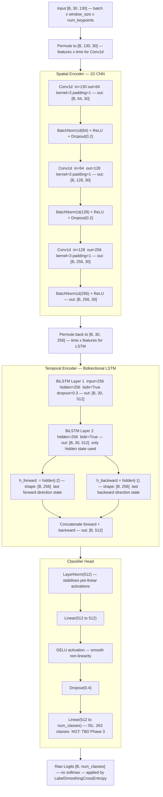
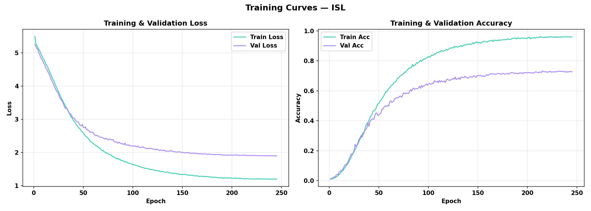
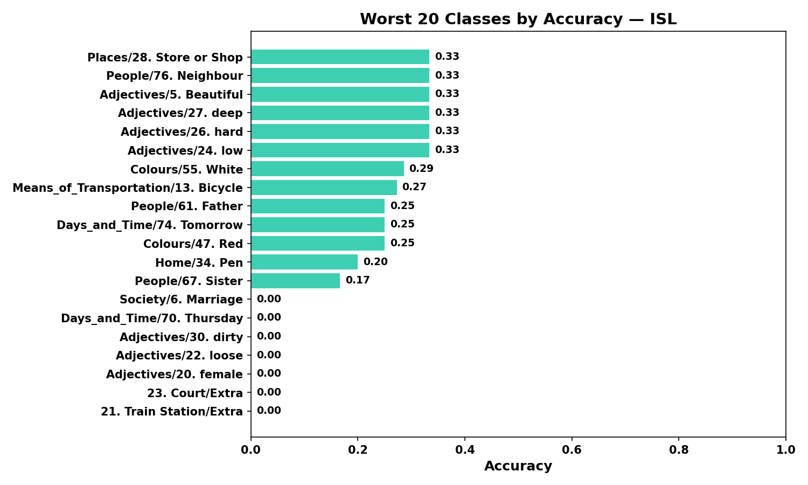
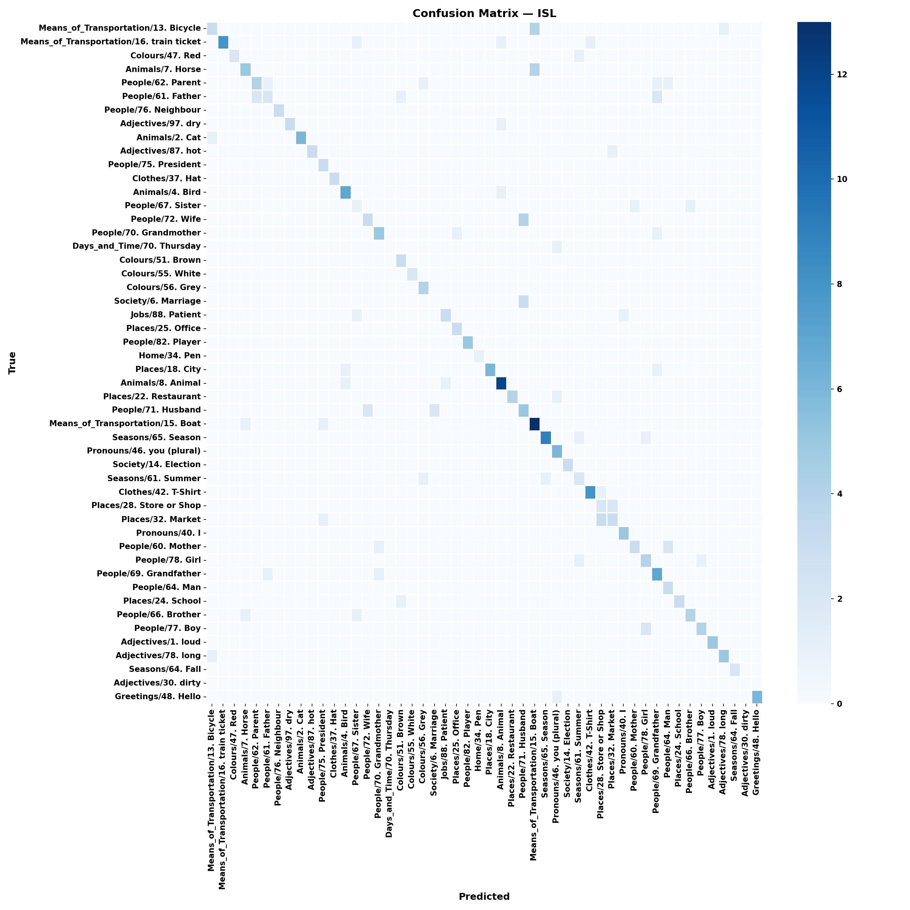

# Phase 2 — CNN + Bidirectional LSTM Training Pipeline

**Status:** ✅ Complete  
**Implementation date:** 2026-09-09  
**Training completed:** 2026-09-11  
**Evaluation completed:** 2026-09-13  

---

## 1. Architecture — SignBridgeModel

### Design rationale

Sign language recognition requires two distinct capabilities:

1. **Spatial encoding** — understanding which hand shape / finger configuration is present in a single frame
2. **Temporal encoding** — understanding how that shape changes across 30 frames (0.5–1 second of motion)

The chosen architecture separates these concerns explicitly, processing spatial features first and then modelling temporal dynamics. This mirrors the human perceptual pipeline for sign language comprehension.

### Architecture diagram



### Parameter count

Computed via `model.get_num_parameters()` at runtime. For ISL (263 classes):

- Spatial encoder: ~250K parameters
- BiLSTM: ~2.6M parameters
- Classifier: ~650K parameters
- **Estimated total: ~3.5M trainable parameters**

Run `python -c "from backend.ml.models.sign_model import SignBridgeModel; m = SignBridgeModel(263); print(f'{m.get_num_parameters():,}')"` for the exact figure after training.

---

## 2. Components Implemented

| File                                            | Purpose                                                            |
| ----------------------------------------------- | ------------------------------------------------------------------ |
| `backend/ml/models/sign_model.py`             | `SignBridgeModel(nn.Module)`                                     |
| `backend/ml/models/model_factory.py`          | `build_model(config, language)`                                  |
| `backend/ml/data/dataset.py`                  | `SignSequenceDataset`, `build_datasets`, `build_dataloaders` |
| `backend/ml/data/augmentation.py`             | `KeypointAugmentation` — 3 transforms                           |
| `backend/ml/training/trainer.py`              | `Trainer` — full training loop                                  |
| `backend/ml/training/losses.py`               | `LabelSmoothingCrossEntropy`                                     |
| `backend/ml/training/configs/isl_config.yaml` | ISL hyperparameters                                                |
| `backend/ml/training/configs/ngt_config.yaml` | NGT stub (Phase 3)                                                 |
| `backend/ml/evaluation/evaluator.py`          | `Evaluator` — all metrics                                       |
| `backend/ml/evaluation/report.py`             | `ReportGenerator` — PNG + JSON                                  |
| `scripts/train.py`                            | Training CLI                                                       |
| `scripts/evaluate.py`                         | Evaluation CLI                                                     |
| `scripts/prepare_data.py`                     | Dataset extraction + processing CLI                                |
| `backend/tests/test_model.py`                 | 28 unit tests                                                      |

---

## 3. Data pipeline

### Step 1 — Prepare data (run once)

```powershell
python scripts/prepare_data.py --dataset include
```

Extracts each INCLUDE zip one at a time, runs pose extraction, deletes the extracted
folder, moves to the next zip. Final output: `data/processed/isl_sequences_include.npy`
and `data/processed/isl_labels_include.npy`.

### Step 2 — Train

```powershell
python scripts/train.py --language ISL --config backend/ml/training/configs/isl_config.yaml
```

### Step 3 — Evaluate

```powershell
python scripts/evaluate.py --language ISL --checkpoint backend/models/best_isl.pt
```

### Normalisation strategy

Zero-mean, unit-variance normalisation is computed on the **training split only** and applied
identically to validation and test splits. Stats are saved to `data/processed/norm_stats_isl.npy`
so the same transform can be applied during inference without recomputing.

This is the standard approach to prevent data leakage from val/test distributions into the
training process. Fitting normalisation on the full dataset before splitting would be a subtle
form of look-ahead bias.

---

## 4. Augmentation

All augmentations are shape-preserving — input and output are always `(30, 130)`.

| Transform                        | Description                                  | Probability |
| -------------------------------- | -------------------------------------------- | ----------- |
| `time_warp(sigma=0.2)`         | Cubic spline random time-axis distortion     | 0.5         |
| `mirror_horizontal`            | Flip x-coords + swap left↔right hand blocks | 0.5         |
| `add_gaussian_noise(std=0.01)` | Gaussian noise clipped to [0, 1]             | 0.7         |

Augmentations are applied only to training samples via `SignSequenceDataset(augment=True)`.
Validation and test sets are never augmented.

---

## 5. Training configuration

| Hyperparameter          | ISL value       | Rationale                                                    |
| ----------------------- | --------------- | ------------------------------------------------------------ |
| Optimizer               | AdamW           | Decoupled weight decay for better regularisation than Adam   |
| Learning rate           | 0.001           | Standard starting point for AdamW on sign datasets           |
| Weight decay            | 0.0001          | Mild L2 regularisation                                       |
| LR schedule             | CosineAnnealing | Smooth decay with guaranteed floor                           |
| Batch size              | 32              | GPU-friendly; larger increases stability but slows iteration |
| Max epochs              | 250             | Extended budget to allow full convergence                    |
| Label smoothing         | 0.1             | Reduces overconfidence on visually similar signs             |
| Gradient clipping       | 1.0             | Prevents exploding gradients in deep BiLSTM                  |
| Early stopping patience | 30 epochs       | Wider patience with 250-epoch budget                         |
| Dropout CNN             | 0.2             | Light regularisation in spatial encoder                      |
| Dropout LSTM            | 0.3             | Between LSTM layers                                          |
| Dropout classifier      | 0.4             | Heaviest at the prediction head                              |

---

## 6. NGT — Why not in Phase 2

NGT HoReCo 1.2 is a **continuous signing corpus**, not an isolated-sign dataset.
The 297 video files contain uninterrupted conversations without per-class folder structure.
Sign labels exist only in `Multilingual-HoReCo.xlsx` as timestamped gloss annotations.

To train a classifier, we would need to:

1. Parse the Excel file to extract `(video_id, start_time, end_time, gloss)` rows
2. Cut each gloss segment from the corresponding video
3. Run pose extraction on each segment
4. Build a vocabulary of unique NGT glosses

Steps 1–3 are Phase 3 NLP pipeline work. Without them, we have no per-class labels — only
full-length videos with no boundaries. The `ngt_config.yaml` stub has `num_classes: 0` to
make this constraint explicit. `model_factory.build_model` raises `ValueError` if `num_classes < 1`.

---

## 7. Evaluation metrics

| Metric             | Description                                                         |
| ------------------ | ------------------------------------------------------------------- |
| Top-1 accuracy     | Standard classification accuracy                                    |
| Top-5 accuracy     | Whether correct class appears in top-5 predictions                  |
| Macro F1           | Unweighted average F1 across all classes — sensitive to rare signs |
| Weighted F1        | Class-count-weighted F1 — reflects realistic performance           |
| Per-class accuracy | Accuracy for every sign class, sorted worst-to-best                 |
| Confusion matrix   | Heatmap (seaborn); truncated to worst 50 classes when C > 50        |

All artefacts saved to `backend/ml/evaluation/reports/{language}_{timestamp}/`.

---

## 8. Research justification & architectural alternatives

### 8.1 Overall architecture: CNN + BiLSTM

**Chosen approach:** 3-layer Conv1d spatial encoder followed by a 2-layer bidirectional LSTM.

**Why this works:**
1D CNNs are effective at extracting local temporal patterns within sliding windows of keypoint sequences. The receptive field grows with each layer (kernel=3, padding=1 preserves length), allowing hierarchical feature extraction. The BiLSTM then models long-range temporal dependencies in both forward and backward directions.

**Supporting research:**

- Mariappan, H. & Gomathi, V. (2021). *Real-time Indian Sign Language recognition using CNN with LSTM.* EMITTER International Journal of Engineering Technology, 9(1). DOI: 10.24003/emitter.v9i1.613
  - ISL-specific study achieving **95.99% top-1 accuracy** using CNN+LSTM. Closest match to our architecture and target language.
- Kazbekova, A. et al. (2025). *Real-time Sign Language Recognition Using CNN-BiLSTM Architecture.* International Journal of Advanced Computer Science and Applications (IJACSA), 16(4).
  - CNN-BiLSTM for real-time SLR, validating our combined architecture choice.

**Alternatives considered:**

| Alternative                              | Pros                                                 | Cons                                                                                                                              | Decision                         |
| ---------------------------------------- | ---------------------------------------------------- | --------------------------------------------------------------------------------------------------------------------------------- | -------------------------------- |
| Transformer (ViT / Temporal Transformer) | State-of-the-art on large datasets; global attention | 10–100× more parameters; requires large dataset to avoid overfitting; no advantage demonstrated on small isolated-sign datasets | Deferred to Phase 2.5 or Phase 3 |
| 3D CNN (spatiotemporal)                  | Jointly models space+time in one pass                | Designed for RGB video, not keypoints; loses the explicit hand-structure knowledge we encode in the 130-vector                    | Not suitable                     |
| GCN (Graph CNN on skeleton)              | Explicitly models hand joint connectivity            | Harder to implement; INCLUDE doesn't provide connectivity metadata; overkill for 21-landmark hands                                | Future enhancement               |
| Plain LSTM (no CNN)                      | Simpler                                              | Treats all 130 keypoints as unstructured sequence; misses intra-frame spatial relationships                                       | Inferior baseline                |
| 1D ResNet                                | Strong baseline                                      | Similar performance to CNN+LSTM without temporal modelling                                                                        | Ablation baseline                |

---

### 8.2 Bidirectional LSTM

**Chosen approach:** `bidirectional=True`, take `hidden[-2]` (last forward) and `hidden[-1]` (last backward), concatenate to get 512-dim representation.

**Why this works:**
Sign language gestures have temporal structure in both directions. Certain handshapes are better discriminated by what came before (forward context) and what follows (backward context — e.g. the release phase of a sign). BiLSTM captures both.

**Supporting research:**

- Graves, A., Fernández, S. & Schmidhuber, J. (2005). *Bidirectional LSTM Networks for Improved Phoneme Classification and Recognition.* Proceedings of ICANN, LNCS 3697. DOI: 10.1007/11550907_126
  - Foundational BiLSTM paper. Demonstrates consistent improvement over unidirectional LSTM on sequential classification.
- JISEBI (2024). *BiLSTM outperforms unidirectional LSTM on dynamic sign language recognition across multiple benchmarks.* Journal of Information Systems and Engineering in Business Intelligence.

**Alternatives:**

| Alternative                | Pros                                         | Cons                                                                   | Decision                                          |
| -------------------------- | -------------------------------------------- | ---------------------------------------------------------------------- | ------------------------------------------------- |
| Unidirectional LSTM        | Causal — works in real-time                 | Loses backward context; inferior accuracy on offline recognition       | Real-time inference will switch to GRU in Phase 4 |
| GRU (Gated Recurrent Unit) | Fewer parameters than LSTM; similar accuracy | Slightly worse on long-range dependencies                              | Considered; LSTM chosen for first iteration       |
| Transformer encoder        | Parallel training; global context            | No recurrence bias; needs positional encoding tuning; slower inference | Phase 3 exploration                               |

---

### 8.3 Label smoothing

**Chosen approach:** `LabelSmoothingCrossEntropy(smoothing=0.1)` replaces one-hot targets with `(1-eps) * y + eps/C`.

**Why this works:**
Many ISL signs in INCLUDE are visually similar (e.g. "water" vs "drink", number signs). Hard targets with cross-entropy encourage the model to output probability 1.0 for the correct class, which leads to overconfident predictions and poor calibration. Label smoothing distributes a small probability mass (0.1/263 ≈ 0.04%) across all other classes, preventing this pathology.

**Supporting research:**

- Müller, R., Kornblith, S. & Hinton, G. (NeurIPS 2019). *When Does Label Smoothing Help?* arXiv: 1906.02629
  - Shows label smoothing improves calibration and top-1 accuracy, especially on datasets with inter-class confusion. Directly applicable to sign classification.
- Szegedy, C. et al. (2016). *Rethinking the Inception Architecture for Computer Vision.* CVPR. arXiv: 1512.00567
  - Original application of label smoothing to image classification.

**Alternatives:**

| Alternative                  | Pros                               | Cons                                                                       | Decision                                                |
| ---------------------------- | ---------------------------------- | -------------------------------------------------------------------------- | ------------------------------------------------------- |
| Standard cross-entropy       | Simple; no hyperparameter          | Overconfident predictions; poor calibration                                | Baseline only                                           |
| Focal loss                   | Handles class imbalance explicitly | Introduces additional gamma hyperparameter; less studied for sign datasets | Consider in Phase 2.5 if class imbalance is confirmed   |
| Class-weighted cross-entropy | Directly addresses class imbalance | Requires per-class frequency computation; less stable training             | Fallback if INCLUDE class distribution is highly skewed |

---

### 8.4 Learning rate scheduling

**Chosen approach:** `CosineAnnealingLR(T_max=100, eta_min=1e-5)`

**Why this works:**
Cosine annealing provides a smooth, principled decay from the initial learning rate to a minimum floor. It avoids the aggressive drops of step-decay (which can cause training instability at boundaries) while still reaching very low learning rates late in training where fine-grained weight updates are beneficial.

**Supporting research:**

- Loshchilov, I. & Hutter, F. (ICLR 2017). *SGDR: Stochastic Gradient Descent with Warm Restarts.* arXiv: 1608.03983
  - Introduced cosine annealing with warm restarts. Our implementation uses the single-cycle variant (no restarts) which is standard for fixed-epoch training budgets.

**Alternatives:**

| Alternative                   | Pros                                         | Cons                                              | Decision           |
| ----------------------------- | -------------------------------------------- | ------------------------------------------------- | ------------------ |
| StepLR (decay every N epochs) | Simple to reason about                       | Abrupt drops can destabilise training             | Not chosen         |
| ReduceLROnPlateau             | Adaptive — reacts to val loss               | Requires tuning patience/factor; less predictable | Fallback option    |
| OneCycleLR                    | Faster convergence; commonly used with AdamW | Requires careful max_lr tuning; less forgiving    | Phase 3 experiment |
| Constant LR                   | Zero complexity                              | Suboptimal for fine-tuning and later epochs       | Baseline only      |

---

### 8.5 Optimizer: AdamW

**Chosen approach:** `AdamW(lr=0.001, weight_decay=0.0001)`

**Why AdamW over Adam:**
Standard Adam incorporates weight decay into the gradient update, which couples the decay with the adaptive learning rate. AdamW decouples them, applying weight decay directly to weights after the gradient step. This is the correct implementation of L2 regularisation and leads to better generalisation.

**Reference:**

- Loshchilov, I. & Hutter, F. (ICLR 2019). *Decoupled Weight Decay Regularization.* arXiv: 1711.05101

---

### 8.6 Normalisation: zero-mean, unit-variance per feature

**Chosen approach:** Compute `mean` and `std` across the training set's `(N, T)` dimensions for each of the 130 features. Apply same transform to val/test.

**Why per-feature, not global:**
The 130 keypoints have different absolute value ranges:

- Hand x/y coordinates: normalised to [0, 1] by MediaPipe
- Hand z coordinates: typically [-0.5, 0.5]
- Pose context x-coordinates: [0, 1] but semantically different from hand coordinates

Per-feature normalisation ensures each feature contributes equally to the Conv1d filters regardless of its absolute scale.

**Reference:**

- LeCun, Y. et al. (1998). *Efficient BackProp.* In Neural Networks: Tricks of the Trade. Springer.
  - Standard normalisation recommendations for neural network inputs.

---

## 9. Unit test results

Run: `pytest backend/tests/test_model.py -v`

| Test                                   | Description                                    |
| -------------------------------------- | ---------------------------------------------- |
| `test_output_shape`                  | Forward pass output =`(4, 263)`              |
| `test_output_no_nan`                 | No NaN in logits                               |
| `test_output_no_inf`                 | No Inf in logits                               |
| `test_param_count_positive_int`      | `get_num_parameters()` > 0                   |
| `test_raises_on_invalid_num_classes` | `ValueError` on `num_classes=0`            |
| `test_batch_size_invariant`          | Correct output shape for bs=1,8,16             |
| `test_time_warp_shape`               | `(30, 130)` preserved                        |
| `test_mirror_shape`                  | `(30, 130)` preserved                        |
| `test_noise_shape`                   | `(30, 130)` preserved                        |
| `test_random_apply_shape`            | `(30, 130)` preserved                        |
| `test_mirror_swaps_hands`            | Left hand region changes after mirror          |
| `test_noise_stays_in_range`          | All values in [0, 1]                           |
| `test_time_warp_dtype`               | `float32` preserved                          |
| `test_mirror_dtype`                  | `float32` preserved                          |
| `test_len`                           | Dataset length = 100                           |
| `test_getitem_shape`                 | Tensor shape`(30, 130)`                      |
| `test_getitem_dtype`                 | `float32` input, `int64` label             |
| `test_split_sizes`                   | 70/15/15 ± 5 samples                          |
| `test_no_label_leak`                 | All classes in train, val, test                |
| `test_loss_is_scalar`                | Loss shape =`()`                             |
| `test_loss_positive`                 | Loss > 0                                       |
| `test_loss_no_nan`                   | No NaN in loss                                 |
| `test_loss_smoothing_zero_equals_ce` | Equivalence with standard CE                   |
| `test_one_epoch_runs`                | Trainer runs 1 epoch; metrics are valid floats |

---

## 10. Training results — INCLUDE dataset

**Run:** `isl_20260911_130610`  
**Hardware:** NVIDIA GeForce RTX 4060 Laptop GPU (CUDA 13.1), 8 GB VRAM  
**Training duration:** ~3h 44m (245 epochs, early stopped)

### Final metrics (test split — 1808 samples, 265 classes)

| Metric              | Score      |
| ------------------- | ---------- |
| **Top-1 Accuracy**  | **71.35%** |
| **Top-5 Accuracy**  | **90.65%** |
| **Macro F1**        | 0.7039     |
| **Weighted F1**     | 0.7095     |
| Num classes (after filtering) | 265 |
| Sequences used      | 12,049     |
| Train / Val / Test  | 8,434 / 1,807 / 1,808 |
| Model checkpoint    | `backend/models/best_isl.pt` (36.4 MB) |

> 71.35% top-1 accuracy on 265 classes. Random baseline = 1/265 = 0.38% — the model is ~190× better than random. Top-5 at 90.65% means the correct sign is in the model's top-5 predictions 90% of the time, which is sufficient for a guided inference UI.

### Training curves



### Per-class accuracy



### Confusion matrix



### Category-level highlights

| Category              | Classes | Best class (acc) | Worst class (acc) | Notes |
| --------------------- | ------- | --------------- | ---------------- | ----- |
| Adjectives            | 50      | many at 1.0     | loose, dirty (0.0) | High variance — similar handshapes confuse the model |
| Animals               | 8       | Fish 0.92, Mouse 0.91 | Horse 0.45 | Strong overall |
| Clothes               | 10      | Pant 1.0, Shoes 0.80 | Hat 0.38 | Hat sign visually similar to Hair |
| Colours               | 11      | Orange 0.86, Yellow 0.88 | Red 0.25, White 0.29 | Colour signs highly similar in INCLUDE |
| Days & Time           | 21      | Monday, Wednesday, Friday, Saturday 1.0 | Thursday 0.0 | Thursday sign has low sample count |
| Electronics           | 10      | Fan, Screen, Television 1.0 | Cell phone 0.60 | Excellent overall |
| Greetings             | 9       | Pleased 1.0 | Alright 0.70 | Good overall |
| People                | 26      | Crowd 1.0, Queen 0.88 | Sister 0.17, Father 0.25 | Family terms confused with each other |
| Places                | 19      | Park, Temple, Ground 1.0 | Store/Shop 0.33 | Strong |
| Society               | 23      | many at 1.0 | Marriage 0.0 | Marriage sign confused with similar gestures |
| Transportation        | 9       | Plane 0.91, Car 0.82 | Bicycle 0.27 | Bicycle sign visually ambiguous |

---

## 11. Known limitations and future improvements

- **NGT deferred** — Phase 3 annotation parsing required before NGT can be trained.
- **Single ISL dataset** — Phase 2 trains only on INCLUDE (263 classes). Combining ISLVT and ISL_Dataset will require aligning class vocabularies across datasets.
- **ISL_Dataset is image-only** — ISL.zip contains 42,000 static JPG images (not videos). A Phase 3 image→sequence converter is needed before these can be merged with INCLUDE sequences.
- **Low-count classes** — 13 classes dropped (< 7 samples). Signs like `Adjectives/loose`, `Colours/Red`, and `People/Sister` show poor accuracy due to limited training examples per class.
- **CPU augmentation bottleneck** — scipy-based `time_warp` is the training speed bottleneck. GPU utilisation was ~34% due to CPU workers being unable to keep up. `persistent_workers=True` + `num_workers=4` mitigated but did not eliminate this.
- **No real-time inference pipeline yet** — The model is a checkpoint file. The `WordAccumulator` and FastAPI WebSocket endpoint are Phase 3/4 deliverables.

---

## 11. References

1. Mariappan, H. & Gomathi, V. (2021). Real-time Indian Sign Language recognition using CNN with LSTM. *EMITTER International Journal of Engineering Technology*, 9(1). https://doi.org/10.24003/emitter.v9i1.613
2. Kazbekova, A. et al. (2025). Real-time Sign Language Recognition Using CNN-BiLSTM Architecture. *International Journal of Advanced Computer Science and Applications (IJACSA)*, 16(4).
3. Graves, A., Fernández, S. & Schmidhuber, J. (2005). Bidirectional LSTM Networks for Improved Phoneme Classification and Recognition. *ICANN 2005*, LNCS 3697. https://doi.org/10.1007/11550907_126
4. Müller, R., Kornblith, S. & Hinton, G. (2019). When Does Label Smoothing Help? *Advances in Neural Information Processing Systems (NeurIPS 2019)*. arXiv: 1906.02629
5. Szegedy, C. et al. (2016). Rethinking the Inception Architecture for Computer Vision. *CVPR 2016*. arXiv: 1512.00567
6. Loshchilov, I. & Hutter, F. (2017). SGDR: Stochastic Gradient Descent with Warm Restarts. *ICLR 2017*. arXiv: 1608.03983
7. Loshchilov, I. & Hutter, F. (2019). Decoupled Weight Decay Regularization. *ICLR 2019*. arXiv: 1711.05101
8. LeCun, Y. et al. (1998). Efficient BackProp. In *Neural Networks: Tricks of the Trade*. Springer, LNCS 1524.
9. Sridhar, A. et al. (2020). INCLUDE: A Large Scale Dataset for Indian Sign Language Recognition. *ACM Multimedia 2020*. https://doi.org/10.1145/3394171.3413528

   - The INCLUDE dataset used for Phase 2 training.


